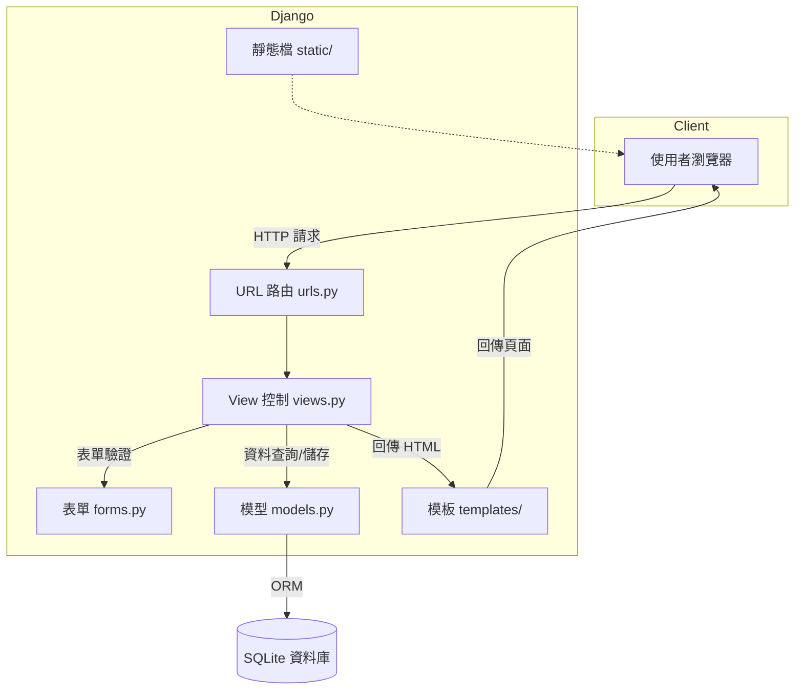
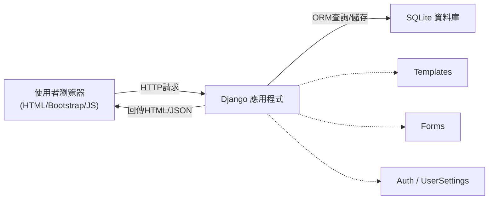
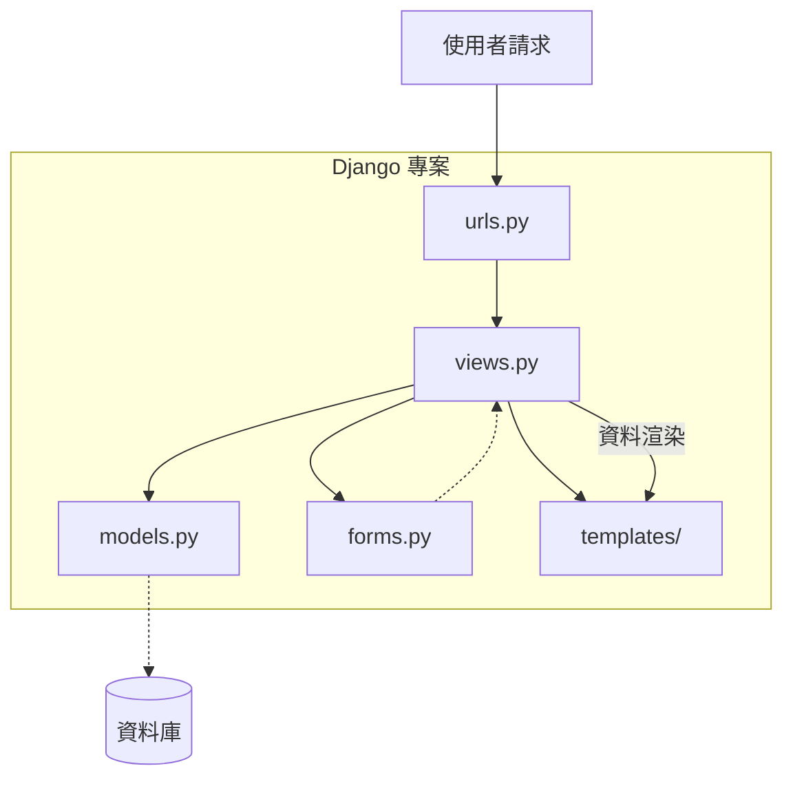
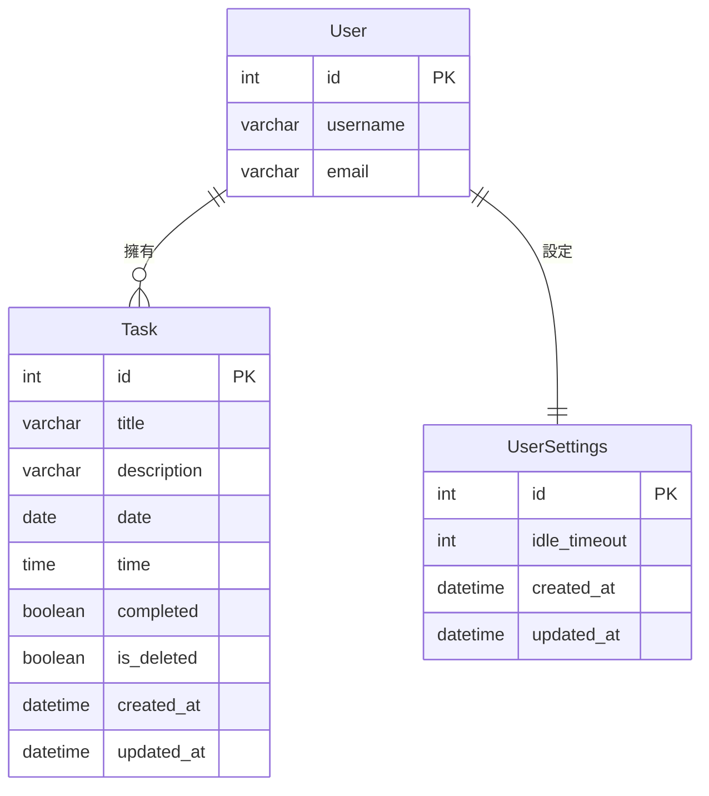

# Todo List 專案報告

## 一、背景說明

本專案以 Django 框架打造一套線上待辦事項管理系統，協助用戶隨時記錄、查詢、管理個人任務。

---

## 二、系統功能

- 用戶註冊、登入、登出
- 任務新增、編輯、刪除、完成/取消完成
- 回收站（垃圾桶）：任務軟刪除、還原、永久刪除
- 批次操作（多選還原/刪除）
- 用戶個人設定（閒置自動登出時間）
- 任務分頁顯示

---

## 三、系統特色

- 資料安全，任務僅本人可見
- 刪除任務先進垃圾桶，避免誤刪
- 支援多任務批次操作
- 閒置自動登出，提升帳號安全

---

## 四、系統設計

### 架構圖



### 網站架構

本系統採用典型的 Django MVC 架構，分為前端（使用者瀏覽器）、後端（Django 應用程式）、資料庫三層。前端以 HTML、Bootstrap 呈現互動介面，後端負責業務邏輯、資料驗證與存取，資料庫則負責持久化所有任務與用戶資料。各層分工明確，易於維護與擴充。

- **前端**：負責顯示任務列表、表單、訊息提示等，並與後端互動。
- **後端**：處理用戶請求、任務 CRUD、批次操作、用戶設定等邏輯。
- **資料庫**：儲存所有任務、用戶、設定等資料。

#### 網站架構圖



### 主要模組

- models
- forms
- views
- urls
- templates

#### 模組設計說明

本專案採用 Django 標準應用分層，主要模組職責如下：

- `models.py`：資料庫模型，定義資料表結構與欄位。
- `forms.py`：表單驗證與輸入格式，確保資料正確性。
- `views.py`：業務邏輯處理，負責接收請求、操作資料、回傳結果。
- `urls.py`：路由設定，將網址對應到正確的 view。
- `templates/`：前端頁面模板，負責資料顯示與互動。
- 其他如 `admin.py`、`apps.py`、`migrations/` 等輔助模組。

#### 模組概述圖



### 資料庫設計

本系統資料庫設計簡潔，主要包含兩個資料表：

- **Task**：儲存每一筆待辦事項，包含標題、描述、日期、時間、完成狀態、刪除狀態、建立/更新時間，並與用戶做關聯。
- **UserSettings**：儲存每位用戶的個人設定（如閒置自動登出秒數），與用戶一對一關聯。

#### 資料表欄位說明

| 資料表      | 欄位                                                         |
|-------------|--------------------------------------------------------------|
| Task        | id, user, title, description, date, time, completed, is_deleted, created_at, updated_at |
| UserSettings| user, idle_timeout, created_at, updated_at                   |

#### 資料庫概述圖

> ※ `PK` -> Primary Key（主鍵），是資料表中唯一識別每一筆資料的欄位。例如 `id PK` 表示該欄位是主鍵，不能重複且不可為空。



---

## 五、畫面與程式說明

### 畫面設計概述

系統介面簡潔直觀，適合桌機與行動裝置瀏覽。主要畫面包含：

- **任務列表頁**：顯示所有未完成與已完成任務，支援分頁、批次操作。
- **編輯/新增任務頁**：以表單方式輸入或修改任務內容。
- **垃圾桶頁**：集中管理已刪除任務，可還原或永久刪除。
- **用戶設定頁**：調整個人閒置自動登出時間等設定。
- **註冊/登入頁**：用戶帳號管理入口。

各頁面皆以 Bootstrap 5 美化，並搭配 FontAwesome 圖示提升辨識度與操作便利性。

---

### 任務列表頁

- 左側：未完成任務（支援分頁、批次操作）
- 右側：已完成任務（可批次還原/刪除）

<div style="display: flex; flex-direction: column; align-items: center; gap: 2rem;">
  
</div>

### 編輯/新增任務

- 表單輸入標題、日期、時間、描述

<div style="display: flex; flex-direction: column; align-items: center; gap: 2rem;">
  
</div>

### 垃圾桶頁

- 顯示已刪除任務，可多選還原或永久刪除

<div style="display: flex; flex-direction: column; align-items: center; gap: 2rem;">
  
</div>

### 用戶設定頁

- 可調整閒置自動登出時間

<div style="display: flex; flex-direction: column; align-items: center; gap: 2rem;">
  
</div>

### 註冊/登入頁

<div style="display: flex; justify-content: center; gap: 2rem; flex-wrap: wrap;">
  
  
</div>

---

## 六、程式片段（models.py 範例與架構說明）

#### models.py 架構圖

models 的資料表關聯結構：


- **User**：Django 內建用戶表，管理所有用戶帳號。
- **Task**：每筆任務都屬於一個 User（多對一），記錄標題、描述、日期、時間、狀態等資訊。
- **UserSettings**：每位 User 對應一筆設定（如閒置自動登出秒數），一對一關聯。

此設計讓任務與用戶、用戶設定之間的關係清楚明確，方便資料查詢與管理。

下方為 `models.py` 的主要程式片段，對應資料庫設計與架構圖中的「模型」區塊：

```python
class Task(models.Model):
    user = models.ForeignKey(User, on_delete=models.CASCADE)  # 任務所屬用戶
    title = models.CharField(max_length=200)                  # 任務標題
    description = models.CharField(max_length=100, blank=True) # 任務描述
    date = models.DateField(default=date.today)               # 任務日期
    time = models.TimeField(default=time(0, 0))               # 任務時間
    completed = models.BooleanField(default=False)            # 是否完成
    is_deleted = models.BooleanField(default=False)           # 是否已刪除
    created_at = models.DateTimeField(auto_now_add=True)      # 建立時間
    updated_at = models.DateTimeField(auto_now=True)          # 更新時間
    # ...existing code...
```

- `user` 欄位與 User 模型關聯，確保每筆任務都屬於某個用戶。
- `title`、`description`、`date`、`time` 等欄位對應任務的基本資訊。
- `completed`、`is_deleted` 用於標記任務狀態，支援回收站與完成/未完成功能。
- `created_at`、`updated_at` 自動記錄任務建立與更新時間，方便排序與追蹤。

此設計讓 views.py 能夠方便地查詢、建立、修改、刪除任務，並透過 forms.py 驗證輸入資料，最後將資料渲染到 templates/ 呈現給使用者。整體流程與「系統設計」章節中的架構圖完全對應，確保程式碼結構清晰、維護容易。

---

## 七、結論

本系統以 Django 框架實作，結合現代前端技術，提供一套安全、易用且功能完善的待辦事項管理平台。透過嚴謹的資料庫設計與分層模組化架構，確保資料安全與系統穩定性。系統支援任務分頁、批次操作、回收站、個人化設定等多元功能，能有效協助用戶管理日常任務、提升工作效率。

此外，系統介面採用響應式設計，無論桌機或行動裝置皆能流暢操作，並以視覺化圖示提升易用性。未來可進一步擴充如任務分類、通知提醒、團隊協作等進階功能，持續優化用戶體驗與應用價值。

本專案不僅強化了開發者對 Django 架構、資料庫設計、前後端整合的實務能力，也展現了現代 Web 應用的設計思維與工程實踐。
